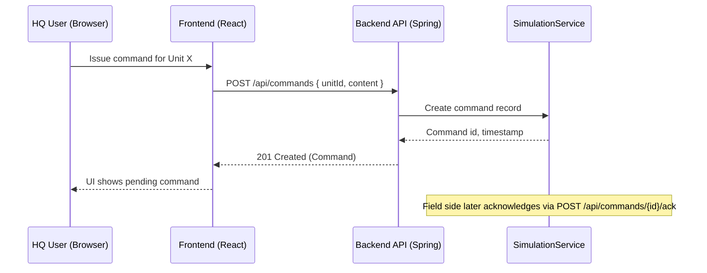
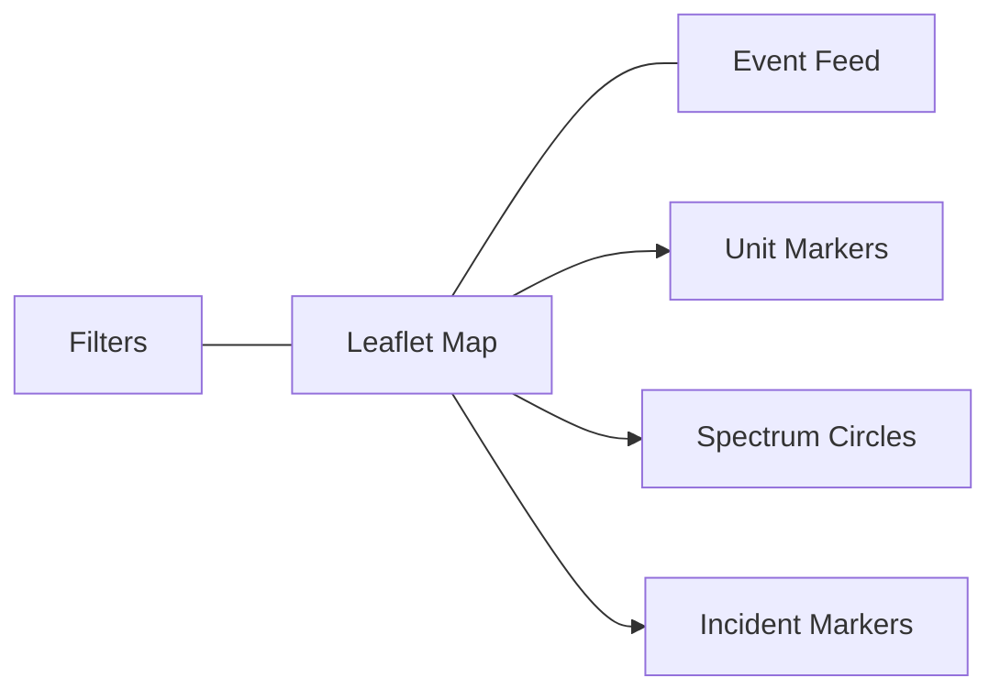

## Common Operational Picture (COP) Simulation System

An end-to-end simulation of a Common Operational Picture (COP) with role-based dashboards, live map, spectrum activity overlays, random incident generation, and HQ–Field command/acknowledgement workflow.

### Key Features

- **Role-based access**
  - **HQ Dashboard**: View all units, spectrum heat, and incidents; send commands to field units.
  - **Field Dashboard**: View assigned units and local activity; acknowledge commands and respond.
- **Live Map**: Leaflet-based map with unit markers, spectrum overlays (VHF/UHF/SHF), and incident markers.
- **Mock Simulation**: Unit positions update every 5–10s; spectrum activities refresh every ~8s; incidents generated every 30s.
- **Clean APIs**: Simple REST endpoints for units, spectrum, incidents, and commands.

### Tech Stack

- **Backend**: Java 21, Spring Boot 3.4.x (web, security, H2)
- **Frontend**: React + Vite + TailwindCSS + React-Leaflet
- **Database**: In-memory H2 (seeded at startup; no persistence)

---

### Architecture

```mermaid
flowchart TD
  subgraph Browser[Web Browser]
    UI[React + Tailwind<br/>Leaflet Map]
  end

  subgraph Backend[Spring Boot Backend]
    API[/REST API\n/api/*/]
    SIM[SimulationService\nSchedulers]
    AUTH[SecurityConfig\nBasic Auth]
  end

  UI -->|Fetch JSON (5s poll)| API
  API --> SIM
  AUTH -. protects .-> API

  SIM -->|Units| API
  SIM -->|Spectrum| API
  SIM -->|Incidents| API
  UI -->|POST Commands| API
```

### HQ–Field Command Sequence



### Components

- `SimulationService`
  - Seeds 5 units, 3 spectrum activities; updates units (~7s), spectrum (~8s), incidents (~30s).
  - Stores in-memory state for units, spectrum, incidents, and commands.
- `ApiController`
  - Exposes `/api/units`, `/api/spectrum`, `/api/incidents`, `/api/commands`.
- `SecurityConfig`
  - Basic Auth with users: `hq:hqpass`, `field:fieldpass`; CORS enabled; CSRF disabled for simplicity.
- Frontend (React + Leaflet)
  - Polls API every 5s; renders units, spectrum circles, incident markers; minimal sidebars.

---

### Repository Layout

```
.
├─ pom.xml                  # Spring Boot backend (root project)
├─ src/                     # Backend source
├─ application.yml          # see src/main/resources/application.yml
├─ frontend/                # React + Vite + Tailwind app
│  ├─ package.json
│  ├─ src/
│  └─ vite.config.ts
└─ guide                    # Original build guide
```

---

### Getting Started

Prerequisites:
- Java 21+
- Node.js 18+ (Node 22 tested)

Backend (Spring Boot):
```
./mvnw spring-boot:run
```
- Runs on: `http://127.0.0.1:8080`
- Users:
  - HQ: `hq` / `hqpass`
  - Field: `field` / `fieldpass`

Frontend (Vite):
```
cd frontend
npm install
npm run dev
```
- Opens at: `http://127.0.0.1:5173`

Production builds:
```
# Backend JAR
./mvnw -DskipTests package

# Frontend static build
cd frontend && npm run build
```

---

### API Reference

- **Authentication**: HTTP Basic
  - `Authorization: Basic base64(username:password)`
  - Roles: `ROLE_HQ`, `ROLE_FIELD` (both can read; HQ typically issues commands)
- **Base URL**: `http://127.0.0.1:8080/api`

Endpoints:
- GET `/units` → List units
- GET `/spectrum` → List spectrum activities
- GET `/incidents` → List incidents
- GET `/commands` → List commands
- POST `/commands` → Issue command
  - Body: `{ "unitId": "unit-1", "content": "Move to X" }`
- POST `/commands/{id}/ack` → Acknowledge command
  - Body: `{ "response": "Affirmative" }`

Example cURL:
```
curl -u hq:hqpass http://127.0.0.1:8080/api/units

curl -u hq:hqpass -H 'Content-Type: application/json' \
  -d '{"unitId":"unit-1","content":"Investigate signal"}' \
  http://127.0.0.1:8080/api/commands

curl -u field:fieldpass -H 'Content-Type: application/json' \
  -d '{"response":"Acknowledged"}' \
  http://127.0.0.1:8080/api/commands/{COMMAND_ID}/ack
```

---

### Configuration

- `src/main/resources/application.yml`
  - Server port: `8080`
  - H2 console enabled (dev): `/h2-console`
  - JPA disabled (in-memory objects only; H2 present for console/reference)

Security:
- Basic Auth; CSRF disabled for API use; CORS enabled for all origins in dev.

Frontend dev server:
- Vite dev server runs at `5173`, configured for `host 0.0.0.0` in `vite.config.ts`.

---

### Data & Simulation Rules

- Units
  - 5 seeded units with random initial locations ~ around (38.9, -77.0)
  - Position jitter every ~7s
- Spectrum
  - VHF, UHF, SHF activities refreshed ~8s; intensity [0..1]
- Incidents
  - Random type every 30s: Signal Jamming, Unidentified Transmission, Interference
- Commands
  - Stored in-memory; acknowledge via dedicated endpoint

---

### Frontend Overview



Polling Strategy:
- Fetch `/units`, `/spectrum`, `/incidents` every 5 seconds.

---

### Development Workflow

- Start backend, then frontend.
- Edit backend under `src/main/java/...` and auto-reload via Spring Devtools (optional) or restart.
- Frontend HMR via Vite during development.

Lint/Format:
- Frontend: `npm run lint`

---

### Troubleshooting

- 401 Unauthorized
  - Ensure Basic Auth header present; credentials correct.
- CORS blocked in browser
  - Dev CORS is enabled; if modified, verify backend `SecurityFilterChain` CORS config.
- Port already in use
  - Change backend port in `application.yml` or stop conflicting process.
  - Change frontend port in `vite.config.ts` or run `npm run dev -- --port 5174`.
- Map tiles not loading
  - Check network to `tile.openstreetmap.org`; ensure no ad-blockers blocking tile domains.
- Frontend cannot reach backend
  - Verify backend at `http://127.0.0.1:8080`; check browser network tab for errors.

---

### Roadmap Ideas

- WebSocket/SSE for push updates
- Persisted storage (Postgres) and repositories
- Multi-tenant role and unit assignment
- Command lifecycle, audit trail, and attachments
- Advanced spectrum heatmaps and layers

---

### License

This repository is for simulation/demonstration purposes.

